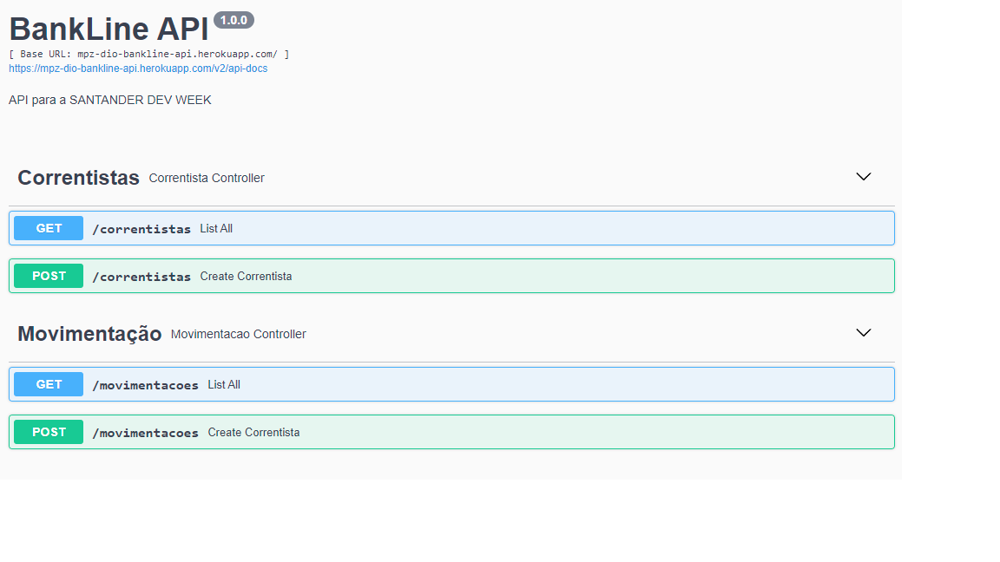

# SANTANDER DEV WEEK!

A Santander Dev Week é uma semana de imersão com 4 dias nas tecnologias mobile e fullstack o seu principal objetivo foi desenvolver uma API REST para a criação de extratos bancários do Santander.

## 02/05 - 05/05 de 2022.

### Dia - 02/05

- **Lançamento da Santander Dev Week**
Um evento ao vivo com a presença de experts do Santander e DIO para comentar sobre o projeto, expectativas, setup e carreira. 
 
- **Preparando os Ambientes de Desenvolvimento:**
Está pronto para uma imersão completa pelos conceitos de back-end, front-end e mobile? Então veio ao lugar certo, neste primeiro conteúdo vamos instalar e configurar todas as ferramentas necessárias para um(a) Dev Full Stack e/ou Mobile;

### Dia - 03/05

- **Sessão 01 - Abstraindo o Domínio Bancário em Uma API REST com Java.**
Com o nosso ambiente de desenvolvimento devidamente pronto, podemos refletir sobre o nosso domínio de aplicação, ou seja, o problema/contexto que desejamos explorar. Nesse sentido, iremos modelar e desenvolver uma API REST usando Java e Spring Boot. Além disso, ainda vamos publicá-la na nuvem (Heroku), para que nossos clientes possam consumi-la através da Internet.

### Dia - 04/05

- **Sessão 02 - Construindo um Front-end Angular de Extrato Bancário**
Chegou a hora de desenvolver um Website usando uma das tecnologias mais hypadas de Front-end, o Angular (Google). Para isso, nossa API REST (publicada no Heroku) será consumida, visando a criação de uma tela de extrato bancário com padrões bem definidos de UI/UX.

### Dia - 05/05

- **Sessão 03 - Construindo um App Android de Extrato Bancário**
Chegamos ao nosso ato final e, com isso, ao universo Mobile. Nesse contexto, aprenda a criar Apps Nativos para Android usando Java e/ou Kotlin, massa hein!? Para isso, vamos construir um App do zero, passando desde a sua estrutura fundamental até elementos mais complexos como a criação de telas (seguindo o Material Design) e consumo de APIs (através da biblioteca Retrofit).

## Imagens do Projeto:

### BackEnd - Swagger

